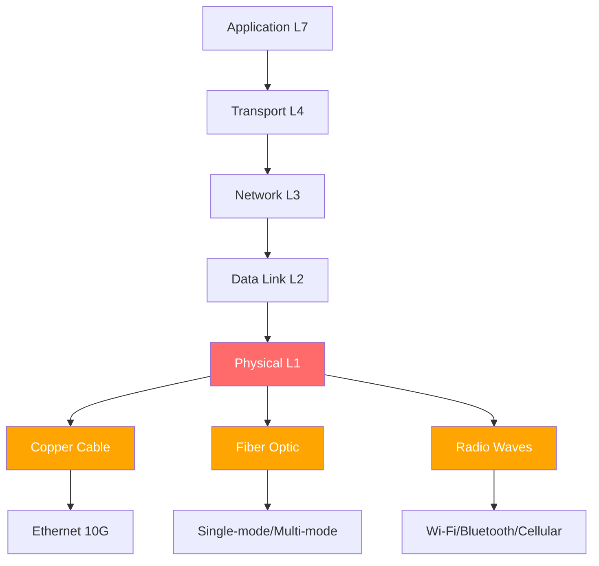

# Connection Types

## Layer Position

```
┌─────────────────────────────────────────────────────────┐
│                   APPLICATION (L7)                      │
│          HTTP, DNS, SMTP, FTP, SSH, TLS                 │
├─────────────────────────────────────────────────────────┤
│                   TRANSPORT (L4)                        │
│              TCP, UDP, QUIC, SCTP                       │
├─────────────────────────────────────────────────────────┤
│                   NETWORK (L3)                          │
│                IPv4, IPv6, ICMP, ARP                    │
├─────────────────────────────────────────────────────────┤
│               DATA LINK (L2)                            │
│          Ethernet (802.3), Wi-Fi (802.11)               │
│              Bluetooth (802.15), PPP                     │
├═══════════════════════════════════════════════════════════┤
│ ▼▼▼  CONNECTION TYPES OPERATE HERE  ▼▼▼                │
│               PHYSICAL (L1)                              │
│    Cables, Fiber, Radio Waves, Connectors               │
│    Signal Encoding, Modulation, Power                    │
└─────────────────────────────────────────────────────────┘
```

Connection types define the physical medium and signaling method used to transmit data between devices. They operate at Layer 1 (Physical) of the OSI model and directly influence Layer 2 (Data Link) behavior. The choice of connection type determines bandwidth ceiling, latency floor, interference susceptibility, and the fundamental attack surface available to adversaries.

## 1. Topic Overview

Connection types are the physical and electromagnetic mechanisms through which digital information travels between computing devices. Each type — copper cable carrying electrical signals, glass fiber carrying light pulses, or antenna radiating radio waves — imposes specific constraints on throughput, distance, reliability, and security posture. Selecting a connection type simultaneously chooses the maximum data rate, noise characteristics, and the threat set the deployment must defend against.

Every connection type introduces unique attack vectors. Wired connections can be tapped physically; wireless connections can be intercepted over the air; cellular connections are vulnerable to IMSI catcher attacks; satellite links face latency exploitation and signal jamming. Understanding these properties is essential for building defense-in-depth architectures where the transport medium itself becomes part of the security perimeter. The internal architecture spans signal encoding (NRZ, Manchester, 4B/5B), modulation (QAM, OFDM, PSK), error correction (CRC, FEC), and medium access control (CSMA/CD, CSMA/CA, TDMA).

## 2. Why It Exists

No single physical medium satisfies all deployment requirements simultaneously. A data center needs 400 Gbps over short distances with minimal latency; a rural household needs internet over miles of terrain; a smartphone needs mobility across cell towers; a medical implant needs low-power, short-range communication. The physics of signal propagation, attenuation, and interference create trade-offs that force specialization. Copper Ethernet provides cost-effective, low-latency connectivity within buildings but suffers from EMI and distance limitations (100m Cat6). Fiber eliminates EMI and spans kilometers but requires expensive transceivers. Wi-Fi offers mobility but shares finite radio spectrum. Each type optimizes a different point in the cost-distance-bandwidth-security matrix.

From a security perspective, diversity of connection types is both vulnerability and strength. Defenders must secure multiple attack surfaces simultaneously, but defense-in-depth is enabled: an air-gapped network uses fiber (immune to EMI) while guest networks use isolated Wi-Fi VLANs. The choice of connection type is itself a security decision.

## 3. Internal Architecture

### 3.1 Wired Connections

**Ethernet (10/100/1000/10G)**

```
┌──────────────────────────────────────────────────────────┐
│                   ETHERNET FRAME                         │
├──────────┬──────────┬─────────┬───────┬──────┬───────────┤
│ Preamble │ Dest MAC │ Src MAC │ Type/ │ Data │    FCS    │
│ 7 bytes  │ 6 bytes  │ 6 bytes │Len 2B │46-   │  4 bytes  │
│          │          │         │       │1500B │           │
└──────────┴──────────┴─────────┴───────┴──────┴───────────┘
         │                                    │
         ▼                                    ▼
   Physical Layer                    Error Detection
   (Signal Encoding)                 (CRC-32)
```

| Standard | Speed | Cable | Max Distance | Encoding |
|----------|-------|-------|--------------|----------|
| 10BASE-T | 10 Mbps | Cat3 | 100m | Manchester |
| 100BASE-TX | 100 Mbps | Cat5 | 100m | 4B/5B + MLT-3 |
| 1000BASE-T | 1 Gbps | Cat5e/6 | 100m | PAM-5 |
| 10GBASE-T | 10 Gbps | Cat6a/7 | 100m | DSQ128 |
| 40GBASE-T | 40 Gbps | Cat8 | 30m | PAM-16 |

Ethernet uses CSMA/CD (Carrier Sense Multiple Access with Collision Detection) in half-duplex mode. Modern switched networks operate in full-duplex, eliminating collisions but not eliminating the ability to sniff traffic via port mirroring (SPAN ports). An attacker with physical access to a switch can mirror all ports and capture every frame traversing the network.

**Fiber Optic**

```
┌─────────────────────────────────────────────────────────┐
│              FIBER OPTIC SIGNAL PATH                    │
│                                                         │
│  LED/Laser ──► Core ──► Cladding ──► Detector          │
│  (Transmitter)  (9µm/  (Reflects    (Photodiode)       │
│                  50µm)   light back)                    │
│                                                         │
│  Single-Mode (9µm core): Long distance, laser source   │
│  Multi-Mode (50/62.5µm): Short distance, LED source    │
└─────────────────────────────────────────────────────────┘
```

| Type | Core Size | Distance | Bandwidth | Security Property |
|------|-----------|----------|-----------|-------------------|
| Single-mode OS2 | 9µm | Up to 100km | 100+ Gbps | Immune to EMI, hard to tap |
| Multi-mode OM3 | 50µm | Up to 300m | 10 Gbps | Easier installation |
| Multi-mode OM4 | 50µm | Up to 400m | 100 Gbps | Higher bandwidth |

Fiber taps require bending the cable to capture escaped light — detectable via optical time-domain reflectometry (OTDR). This makes fiber inherently more secure than copper against passive eavesdropping.

**Cable (DOCSIS)**

DOCSIS (Data Over Cable Service Interface Specification) modulates digital data onto coaxial cable using QAM (Quadrature Amplitude Modulation). DOCSIS 3.1 supports 10 Gbps downstream using OFDM across 1.2 GHz of spectrum. Cable networks share bandwidth among subscribers on the same segment, making cable modems vulnerable to traffic sniffing if encryption (BPI+) is not enforced.

**DSL (Digital Subscriber Line)**

DSL uses existing telephone copper pairs with frequency-division multiplexing. Voice occupies 0-4 kHz; data occupies higher frequencies (up to 2.2 MHz for VDSL2). The distance from the DSLAM (Digital Subscriber Line Access Multiplexer) directly limits achievable speed — signal attenuation follows the inverse square law. DSL is a point-to-point technology, providing inherent isolation between subscribers at the physical layer.

### 3.2 Wireless Connections

**Wi-Fi (802.11a/b/g/n/ac/ax)**

```
┌─────────────────────────────────────────────────────────┐
│              Wi-Fi PROTOCOL EVOLUTION                    │
├────────┬────────┬────────┬────────┬────────┬────────────┤
│ 802.11b│ 802.11a│ 802.11g│ 802.11n│ 802.11ac│ 802.11ax │
│ 2.4GHz │  5GHz  │ 2.4GHz │2.4/5GHz│  5GHz  │2.4/5/6GHz │
│ 11Mbps │ 54Mbps │ 54Mbps │600Mbps │ 6.9Gbps│ 9.6Gbps  │
│ DSSS   │  OFDM  │  OFDM  │MIMO/OFDM│MU-MIMO│ OFDMA    │
│  WEP   │  WEP   │ WPA    │ WPA2   │ WPA2/3 │  WPA3    │
└────────┴────────┴────────┴────────┴────────┴────────────┘
```

Wi-Fi uses CSMA/CA (Collision Avoidance) because radio cannot detect collisions while transmitting. The RTS/CTS (Request to Send / Clear to Send) handshake reserves the medium. WPA3-SAE replaces WPA2-PSK's 4-way handshake with Simultaneous Authentication of Equals, preventing offline dictionary attacks against captured handshakes.

**Bluetooth**

```
Standby ──► Inquiry ──► Page ──► Connected (Active/Sniff/Park)
```

Bluetooth operates in the 2.4 GHz ISM band using FHSS across 79 channels at 1600 hops/second. Classic Bluetooth (BR/EDR) and BLE use different hopping schemes. Pairing vulnerabilities include passive eavesdropping during legacy PIN-based pairing and MITM attacks during Secure Simple Pairing if numeric comparison is not verified.

**Cellular (4G/5G)**

```
UE (Phone) ──► eNB (Tower) ──► EPC (Core) ──► Internet
  IMSI/MEID      Radio Bearers   GTP Tunnels
  (plaintext 4G) (encrypted)     (IP transport)
  SUCI (encrypted in 5G)
```

5G improves over 4G by encrypting the subscriber identifier (IMSI) as SUCI using public-key cryptography, mitigating IMSI catcher attacks. However, 5G's reliance on network slicing introduces new attack surfaces at the virtualization boundary.

**Satellite**

Satellite connections use geostationary (GEO, 36,000km), medium Earth orbit (MEO, 2,000km), or low Earth orbit (LEO, 550km) constellations. LEO constellations (Starlink, OneWeb) reduce latency from ~600ms (GEO) to ~20-40ms. All satellite links face signal propagation delay, atmospheric attenuation, and the challenge of secure key distribution across high-latency channels.

**NFC (Near Field Communication)**

NFC operates at 13.56 MHz with a maximum range of 10cm. It uses inductive coupling between two loop antennas. NFC is used for contactless payments (EMV), access cards, and device pairing. The short range is a physical security feature, but relay attacks can extend the effective range using custom hardware.

### 3.3 Connection Topology

```
STAR: Central hub, single failure point        BUS: Shared medium, easy to tap
┌─┐                  ───────                   
│C│  ┌─┐            │ │ │ │                   
 ├───┤ │             ─┤ ├─┤ ─                 
┌┤   │ │├┐           ───────                  
└────┘ └┘           

RING: Token passing, deterministic             MESH: Redundant paths, resilient
┌───┐                ┌───┐
│   │               /│   │\
┌┤   ├┐             / └─┬─┘ \
│└─┬─┘│            /   │   \
└──┼──┘           └┐   │   ┌┘
   │                └┬──┴──┘
```

| Topology | Redundancy | Failure Impact | Security Implication |
|----------|------------|----------------|---------------------|
| Star | Low | Single switch failure isolates nodes | Centralized monitoring point |
| Bus | None | Cable break kills segment | Easy to tap (shared medium) |
| Ring | Medium | Unidirectional break disrupts ring | Token passing = predictable timing |
| Full Mesh | High | Any single link failure tolerated | Many paths = hard to control traffic flow |

## 4. Component Breakdown

| Component | Purpose | Responsibilities | Inputs | Outputs | Dependencies | Failure Cases | Security Risks |
|-----------|---------|-----------------|--------|---------|--------------|---------------|----------------|
| NIC | Network interface | Frame TX/RX, MAC addressing | OS packets | Wire signals | Driver, firmware | Link down, buffer overflow | MAC spoofing, driver exploits |
| Antenna | RF signal conversion | Convert electrical to RF energy | Baseband signal | Radiated wave | Transceiver circuit | Impedance mismatch, damage | Eavesdropping, jamming |
| Switch | L2 forwarding | MAC learning, frame switching | Ethernet frames | Forwarded frames | Power, CAM table | Broadcast storm, CAM overflow | CAM overflow attack, VLAN hopping |
| Access Point | Wireless bridge | SSID broadcast, client auth | 802.11 frames | Wired frames | Controller or local config | Deauth flood, rogue AP | Evil twin, KRACK, FragAttacks |
| Modem | Signal modulation | Convert digital to line coding | Data bits | Modulated signal | ISP infrastructure | Sync loss, noise | Line tapping, credential theft |
| Router | L3 forwarding | Routing decisions, NAT, ACLs | IP packets | Forwarded packets | Routing table, CPU | Routing loop, DoS | Route injection, ACL bypass |
| Firewall | Traffic filtering | Packet inspection, rule enforcement | Packets | Allowed/denied | Rule set, state table | Rule misconfig, bypass | Evasion techniques, rule pollution |
| SFP/SFP+ | Optical transceiver | E/O conversion for fiber | Electrical signals | Optical signals | Fiber cable, power | Laser degradation, dirty connector | Physical interception, supply chain |

## 5. Step-by-Step Workflow

When a device establishes a connection:

```
Step 1: Physical Link Detection
  NIC detects carrier signal (cable plugged in) or associates with AP
  │
  ▼
Step 2: Layer 2 Initialization
  DHCP discover → DHCP offer → DHCP request → DHCP ack
  Obtains: IP, subnet mask, default gateway, DNS servers
  │
  ▼
Step 3: ARP Resolution
  Who has <gateway_ip>? → <gateway_mac> is at <mac_address>
  │
  ▼
Step 4: Layer 3 Connectivity
  ICMP echo request → ICMP echo reply (ping gateway)
  │
  ▼
Step 5: Layer 4 Connection (TCP)
  SYN → SYN-ACK → ACK (3-way handshake)
  │
  ▼
Step 6: Layer 7 Session
  TLS handshake (if HTTPS):
    ClientHello → ServerHello → Certificate → Key Exchange → Finished
  │
  ▼
Step 7: Data Transfer
  Application data flows through the established connection
```

## 6. Data Flow

```
APPLICATION DATA
       │
       ▼
┌──────────────────────────────┐
│  TCP/UDP Header (8-20 bytes) │  ← Segmentation, port addressing
│  + TLS Record (5+ bytes)     │  ← Encryption, integrity
└──────────────┬───────────────┘
               ▼
┌──────────────────────────────┐
│  IP Header (20-60 bytes)     │  ← Routing, TTL, fragmentation
│  + ESP Header (if IPsec)     │  ← Tunnel/transport encryption
└──────────────┬───────────────┘
               ▼
┌──────────────────────────────┐
│  Ethernet Header (14 bytes)  │  ← MAC addressing
│  + 802.1Q VLAN Tag (4 bytes) │  ← VLAN isolation
│  + FCS (4 bytes)             │  ← Error detection
└──────────────┬───────────────┘
               ▼
┌──────────────────────────────┐
│  Physical Encoding           │  ← NRZ, MLT-3, PAM-5
│  + Preamble (7 bytes)        │  ← Clock synchronization
│  + SFD (1 byte)              │  ← Frame start delimiter
└──────────────────────────────┘
               │
               ▼
        PHYSICAL MEDIUM
    (Copper / Fiber / Radio)
```

## 7. Control Flow

```
┌─────────┐     ┌──────────┐     ┌──────────┐
│  CLIENT │     │  SWITCH  │     │  SERVER  │
└────┬────┘     └────┬─────┘     └────┬─────┘
     │               │                │
     │──DHCP Discover──►              │
     │               │──DHCP Offer───►│
     │◄──DHCP Ack────│               │
     │               │                │
     │──ARP Who-has──►               │
     │               │──ARP Reply────►│
     │               │                │
     │──TCP SYN──────►               │
     │               │──TCP SYN-ACK──►│
     │◄──TCP ACK─────│               │
     │               │                │
     │──TLS ClientHello──────────────►│
     │◄──TLS ServerHello + Cert──────│
     │──TLS Key Exchange──────────────►│
     │◄──TLS Finished─────────────────│
     │               │                │
     │──Application Data──────────────►│
     │◄──Application Data─────────────│
     │               │                │
     │──TCP FIN──────►               │
     │◄──TCP FIN-ACK─│               │
     │──TCP ACK──────►               │
```

## 8. Memory Flow

Network connections use multiple buffer layers:

```
Application Buffer (user space)
  send() / write() data stored here
        │ kernel copy
        ▼
Socket Send Buffer (kernel space)
  TCP segmentation, ring buffer: head (app) / tail (NIC TX)
  Default: 16KB-4MB (kernel tunable)
        │
        ▼
TX Descriptor Ring (DMA)
  NIC reads descriptors, DMA to packet memory, writes to wire

RX Path (reverse): NIC DMA → RX Descriptor → Socket Receive Buffer → App

Buffer Bloat: Excessive buffering adds latency
Mitigation: fq_codel, CoDel queue discipline
```

TCP autotuning adjusts buffer sizes dynamically. `net.core.rmem_max` and `net.core.wmem_max` in Linux control maximum buffer sizes. Misconfigured buffers cause packet loss (too small) or memory exhaustion (too large).

## 9. Hardware Interaction

```
NIC Internal Architecture:
  MAC Controller ──► PHY (Transceiver) ──► Connector (RJ45/SFP)
       │
  Bus Interface (PCIe)
       │
  DMA Engine ←→ Packet Buffer Memory (on-chip)
  Ring Buffers (TX/RX), Interrupt Coalescing
  Checksum Offload, RSS (Receive Side Scaling)

Security-relevant NIC features:
  - MAC address filtering (bypassable)
  - 802.1X supplicant (hardware-enforced auth)
  - SR-IOV (virtual function isolation)
  - Hardware timestamping (precise attack forensics)
```

For wireless, the radio chain includes: baseband processor → DAC → mixer → power amplifier → antenna. Each stage can introduce noise, distortion, or be exploited for signal intelligence (SIGINT).

## 10. Operating System Interaction

The Linux network stack:

```
Userspace: Applications (curl, ssh, nginx)
─────────────────────────────────────────────────
Kernel:
  Socket Layer (syscall interface)
  TCP/UDP Protocol Handlers
  Netfilter / iptables / nftables (filtering)
  Traffic Control (tc) / qdisc (scheduling)
  Network Device Drivers
  Socket Buffers (sk_buff) - core data structure

Key sysctl parameters:
  net.ipv4.ip_forward        = 0 (routing)
  net.ipv4.conf.all.rp_filter = 1 (anti-spoofing)
  net.ipv4.tcp_syncookies     = 1 (SYN flood defense)
  net.ipv4.conf.all.accept_redirects = 0
  net.ipv4.conf.all.send_redirects = 0
```

Windows uses the Windows Filtering Platform (WFP) and NDIS for kernel-mode and user-mode filtering at multiple layers (L2-L7).

## 11. Network Interaction

| Layer | Protocol | Connection Type Dependency |
|-------|----------|--------------------------|
| L1 | Ethernet signaling, RS-232, RS-485 | Defines physical encoding |
| L2 | 802.3, 802.11, 802.15 (Bluetooth), PPP | Medium access control |
| L3 | IPv4, IPv6, ICMP, ARP, NDP | Independent of physical medium |
| L4 | TCP, UDP, QUIC | Reliability adapts to medium errors |
| L7 | HTTP, DNS, SMTP, SSH | Application-agnostic transport |

ARP operates at L2/L3 boundary. On Ethernet, ARP resolves IP to MAC. On Wi-Fi, the 4-way handshake (WPA2) or SAE (WPA3) replaces simple ARP with encrypted key exchange before data flows.

## 12. Security Perspective

**What attackers target:**
- **Physical taps**: Ethernet cable intercepts, fiber bends, copper wiretaps
- **Wireless interception**: Packet capture on open Wi-Fi, deauth attacks to force reconnects
- **Signal intelligence**: Cellular IMSI catchers (Stingray), satellite signal interception
- **Credential harvesting**: Rogue access points, evil twin attacks, Bluetooth spoofing
- **Jamming**: Wi-Fi deauthentication flooding, Bluetooth jamming, cellular DoS

**What defenders protect:**
- **Confidentiality**: WPA3, 802.1X (EAP-TLS), IPsec, MACsec (802.1AE)
- **Integrity**: CRC/FCS for accidental errors, cryptographic MACs for intentional tampering
- **Availability**: Redundant paths, load balancing, physical security of infrastructure
- **Authentication**: 802.1X port-based auth, certificate-based Wi-Fi, SIM-based cellular auth
- **Accounting**: RADIUS/TACACS+ logging, NetFlow, sFlow

## 13. Attack Surface

```
┌──────────────┬──────────────────────────────────────────┐
│ PHYSICAL     │ Cable tapping, port access, device theft │
│              │ USB rubber ducky, hardware implants      │
│              │ Electromagnetic emanation (TEMPEST)      │
├──────────────┼──────────────────────────────────────────┤
│ L2           │ MAC flooding, VLAN hopping, ARP spoofing │
│              │ STP manipulation, DHCP starvation        │
│              │ 802.1X bypass, EAP relay attacks         │
├──────────────┼──────────────────────────────────────────┤
│ L3           │ IP spoofing, ICMP redirect, route inject │
│              │ Fragmentation attacks                    │
├──────────────┼──────────────────────────────────────────┤
│ L4           │ SYN flood, RST injection, session hijack │
│              │ TCP sequence prediction, port scanning   │
├──────────────┼──────────────────────────────────────────┤
│ WIRELESS     │ Evil twin, deauth flood, KRACK, FragAtk  │
│              │ WPS brute force, rogue AP, BLE MITM      │
├──────────────┼──────────────────────────────────────────┤
│ CELLULAR     │ IMSI catcher, SIM swap, SS7 exploitation │
│              │ Baseband exploits, fake cell towers      │
└──────────────┴──────────────────────────────────────────┘
```

## 14. Defensive Perspective

| Layer | Control | Implementation |
|-------|---------|---------------|
| Physical | Locked cabinets, cable locks, tamper detection | Chassis locks, port locks, environmental monitoring |
| L1/L2 | 802.1X authentication, port security | RADIUS + certificates, MAC address limits per port |
| L2 | VLAN segmentation, private VLANs | Isolate guest, IoT, production traffic |
| L2 | DHCP snooping, Dynamic ARP Inspection | Prevent rogue DHCP, ARP spoofing |
| L3 | IPsec, MACsec (802.1AE) | Encrypt L2 frames, authenticate peers |
| L3 | Network segmentation, microsegmentation | Zero-trust architecture, NSX/ACI |
| L4 | TLS 1.3, mutual TLS | Encrypt application traffic, verify both endpoints |
| L7 | WAF, IDS/IPS | Deep packet inspection, anomaly detection |
| Wireless | WPA3-Enterprise, 802.1X | EAP-TLS with certificates, not PSK |
| Wireless | WIDS/WIPS | Detect rogue APs, deauth floods |
| Cellular | Private LTE/5G networks | Dedicated spectrum, enterprise core |
| All | Network monitoring, SIEM | Full packet capture, flow analysis |

## 15. Debugging Perspective

Essential tools for connection troubleshooting:

```bash
# Physical layer
ethtool eth0              # Link status, speed, duplex
ip link show              # Interface state
dmesg | grep -i eth       # Driver messages

# Layer 2
arp -a                    # ARP table
bridge fdb show           # MAC forwarding database
tc -s qdisc show          # Queue discipline stats

# Layer 3
ip addr show              # IP configuration
ip route show             # Routing table
ping -c 3 <gateway>       # Connectivity test
traceroute <target>       # Path discovery
mtr <target>              # Real-time path analysis

# Layer 4
ss -tuln                  # Open ports (modern netstat)
nc -zv <host> <port>      # Port connectivity test
tcpdump -i eth0 port 443  # Packet capture
nmap -sS -sV <host>       # SYN scan + version detection

# Wireless
iwconfig                  # Wireless interface info
iw dev wlan0 scan         # Scan nearby networks
airmon-ng start wlan0     # Monitor mode
airodump-ng wlan0mon      # Capture 802.11 frames
```

## 16. Reverse Engineering Perspective

Protocol analysis using Wireshark dissectors:

```
Wireshark Display Filters:
  eth.addr == 00:11:22:33:44:55     # Filter by MAC
  ip.addr == 192.168.1.0/24         # Filter by subnet
  tcp.port == 443                   # HTTPS traffic
  wlan.fc.type_subtype == 0x0c      # Wi-Fi deauth frames
  bluetooth HCI ACL                 # Bluetooth data
  dns.qry.name contains "evil"      # DNS queries to domain

Packet dissection layers:
  Frame → Ethernet II → [802.1Q] → IP → [TCP/UDP] → [TLS] → HTTP

Protocol reverse engineering workflow:
  1. Capture traffic with tcpdump/Wireshark
  2. Identify protocol via port and packet structure
  3. Map message types and field positions
  4. Identify encryption/encoding schemes
  5. Test with modified packets (Scapy)
  6. Document protocol state machine
```

Python packet crafting with Scapy:
```python
from scapy.all import *

# Ethernet frame
frame = Ether(dst="ff:ff:ff:ff:ff:ff") / IP(dst="192.168.1.1") / ICMP()
sendp(frame, iface="eth0")

# 802.11 deauth (testing only)
deauth = RadioTap() / Dot11(addr1="ff:ff:ff:ff:ff:ff",
                             addr2="aa:bb:cc:dd:ee:ff",
                             addr3="aa:bb:cc:dd:ee:ff") / Dot11Deauth(reason=7)
sendp(deauth, iface="wlan0mon", count=10)
```

## 17. Flowcharts

### Connection Establishment Decision

```
Need to send data?
  │
  ▼
Wired or Wireless?
  │YES                    │NO
  ▼                       ▼
Cable/fiber OK?      What range?
  │YES    │NO           <10cm: NFC
  ▼       ▼             <100m: Wi-Fi
Assign IP via       <1km: BLE
DHCP or static      Any: Cellular
  │
  ▼
Verify gateway reachable (ARP)
  │
  ▼
Establish L4 connection (TCP)
  │
  ▼
Apply encryption (TLS/IPsec)
  │
  ▼
Transfer data
```

### Wireless Authentication Flow

```
Client              AP                RADIUS
  │──Probe Request──►│                  │
  │◄──Probe Response──│                  │
  │──Auth Request────►│                  │
  │──Assoc Request───►│                  │
  │◄──Assoc Response──│                  │
  │                    │                  │
  [WPA2-Enterprise 802.1X path]
  │◄──EAP Request/Identity──│              │
  │──EAP Response──────────►│──Access Req──►│
  │◄──EAP-TLS cert exchange─────────────────│
  │──EAP Success───────────│──Access Accept─►│
  │──4-Way Handshake──────►│               │
  │◄──Data encrypted────────│               │
```

## 18. Mermaid Diagrams

### OSI Layer Mapping



### Connection Type Security Matrix

```mermaid
quadrantChart
    title Connection Type: Security vs Convenience
    x-axis Low Security --> High Security
    y-axis Low Convenience --> High Convenience
    quadrant-1 "Secure & Convenient"
    quadrant-2 "Secure & Inconvenient"
    quadrant-3 "Insecure & Inconvenient"
    quadrant-4 "Insecure & Convenient"
    "Open Wi-Fi": [0.15, 0.85]
    "WPA2-PSK Wi-Fi": [0.4, 0.8]
    "WPA3-Enterprise": [0.85, 0.7]
    "Wired Ethernet": [0.7, 0.6]
    "Fiber Optic": [0.95, 0.4]
    "Bluetooth": [0.3, 0.75]
    "Cellular 5G": [0.65, 0.9]
    "NFC": [0.6, 0.5]
    "Air-gapped Fiber": [1.0, 0.1]
```

## 19. Practical Examples

**Scenario 1: Corporate Wi-Fi Security**
A hospital deploys WPA3-Enterprise with EAP-TLS. Each device has a certificate issued by an internal CA. The RADIUS server checks certificate revocation. Guest traffic is isolated on a separate VLAN with captive portal and bandwidth limits. WIDS monitors for rogue APs every 60 seconds.

**Scenario 2: Data Center Interconnect**
Two data centers are connected via single-mode fiber running 100GBASE-LR4. MACsec (802.1AE) encrypts all frames at line rate. The fiber path is diverse (different physical routes) to prevent single-point cable cuts. OTDR monitoring detects fiber bends or cuts within seconds.

**Scenario 3: Remote Worker VPN**
A remote worker connects via home Wi-Fi (WPA3) → IPSec tunnel to corporate gateway → internal resources. Split tunneling is disabled to force all traffic through the corporate firewall. The VPN gateway checks device posture (patch level, antivirus status) before granting access.

**Scenario 4: IoT Deployment**
Smart building sensors use BLE Mesh for intra-building communication and cellular (NB-IoT) for cloud connectivity. BLE traffic is encrypted with AES-CCM. Cellular SIMs use private APN with IPsec backhaul. Physical tamper detection triggers device wipe.

## 20. Hands-on Labs

**Lab 1 (Simple): Inspect Your Network Connection**
```bash
# Check your current connection type
ip link show
ethtool eth0 2>/dev/null || iwconfig wlan0 2>/dev/null

# View your IP configuration
ip addr show

# Trace the path to a remote host
traceroute 8.8.8.8
```

**Lab 2 (Intermediate): Capture and Analyze Traffic**
```bash
# Capture 802.11 frames in monitor mode
sudo ip link set wlan0 down
sudo iw dev wlan0 set type monitor
sudo ip link set wlan0 up
sudo tcpdump -i wlan0 -c 100 -w capture.pcap

# Analyze with Wireshark
wireshark capture.pcap

# Filter for specific protocols
# In Wireshark: ip.addr == 192.168.1.100 && tcp.port == 443
```

**Lab 3 (Advanced): Rogue Access Point Detection**
```bash
# Deploy a honeypot AP using hostapd
cat > /etc/hostapd/honeypot.conf << 'EOF'
interface=wlan1
driver=nl80211
ssid=FreeWiFi
channel=6
hw_mode=g
wpa=0
EOF

# Monitor for connections
sudo hostapd /etc/hostapd/honeypot.conf
# Log all connecting MAC addresses for analysis
```

**Mini Project: Connection Type Comparison Report**
Capture traffic on Wi-Fi and wired connections simultaneously. Compare: throughput (iperf3), latency (ping), jitter (ping statistics), packet loss, and encryption overhead. Document which connection type is appropriate for different security requirements.

## 21. Interview Questions

**Beginner**

1. **What is the difference between wired and wireless connections?**
   Wired uses physical cables (copper/fiber) for dedicated, high-bandwidth, low-interference communication. Wireless uses radio waves for mobility but shares spectrum, introducing interference and eavesdropping risks.

2. **Why does Ethernet have a 100-meter distance limit?**
   Signal attenuation in copper increases with distance and frequency. Beyond 100m, signal degradation causes bit errors. Repeaters or switches regenerate signals at each hop.

3. **What is an SSID?**
   Service Set Identifier — the name broadcast by a Wi-Fi access point. SSIDs are sent in probe requests and beacon frames in plaintext, even on encrypted networks.

4. **How does Bluetooth differ from Wi-Fi?**
   Bluetooth uses FHSS across 79 channels in 2.4 GHz with lower power (10-100m). Wi-Fi uses wider channels (20-160 MHz) with higher power (100m+). Bluetooth is for personal area networks; Wi-Fi for local area.

5. **What is the purpose of a NIC?**
   Network Interface Card converts digital data into signals suitable for the physical medium and vice versa. It handles L1/L2 functions including framing and MAC addressing.

**Intermediate**

6. **Explain the difference between WPA2-PSK and WPA3-SAE.**
   WPA2-PSK uses a 4-way handshake deriving PTK from PMK. Attackers capturing the handshake can perform offline dictionary attacks. WPA3-SAE uses Simultaneous Authentication of Equals (zero-knowledge proof) preventing offline attacks even with weak passwords.

7. **What is MACsec (802.1AE) and how does it differ from IPsec?**
   MACsec encrypts at L2 (Ethernet frames), hop-by-hop between directly connected devices. IPsec operates at L3 (IP packets), providing end-to-end encryption. MACsec is faster (hardware offload) but doesn't protect across multiple hops.

8. **How does a VLAN hopping attack work?**
   Attackers craft double-tagged frames (802.1Q) to reach a different VLAN. Prevention: disable DTP on trunk ports, use explicit VLAN assignments, prune native VLANs.

9. **Single-mode vs multi-mode fiber security perspective?**
   Single-mode (9µm) carries light over long distances; tapping requires precise equipment but is possible. Multi-mode (50µm) has larger core, easier to tap. Both are more secure than copper (immune to EMI), but fiber taps are detectable via OTDR.

10. **What is an IMSI catcher and how does 5G mitigate it?**
    An IMSI catcher (Stingray) impersonates a cell tower. In 4G, IMSI is sent in plaintext. 5G encrypts it as SUCI using public-key cryptography, preventing passive interception.

**Advanced**

11. **Describe a TCP simultaneous open.**
    Both endpoints send SYN packets simultaneously. Each receives SYN before sending SYN-ACK, transitioning to SYN-RECEIVED. Both send SYN-ACK; upon receipt, both move to ESTABLISHED. Rare because it requires simultaneous initiation.

12. **How does buffer bloat affect performance?**
    Excessive buffering adds latency without improving throughput. Packets queue behind large buffers causing latency spikes. Mitigation: CoDel and fq_codel actively drop or ECN-mark packets before buffers fill.

13. **Security implications of TCP timestamps?**
    They enable PAWS and RTTM but leak system uptime, enabling remote OS fingerprinting. Disable with `net.ipv4.tcp_timestamps=0` if uptime disclosure is a concern.

14. **NAT traversal vulnerability and UPnP?**
    NAT hides internal IPs but breaks inbound connections. UPnP automatically creates port mappings without user consent. Attackers exploit UPnP for persistent tunnels. Mitigation: disable UPnP, use manual port forwarding.

15. **Side-channel attack exploiting connection timing?**
    Attackers measure RTT to infer network topology or data patterns. Encrypted queries may have timing differences revealing record sizes. Mitigation: constant-time implementations, traffic padding, jitter injection.

## 22. Knowledge Check

**Multiple Choice**

1. Which connection type provides immunity to electromagnetic interference?
   - A) Cat6 Ethernet  B) Coaxial cable  C) Single-mode fiber  D) USB cable
   Answer: C

2. WPA3-SAE prevents which type of attack?
   - A) Evil twin  B) Offline dictionary attack  C) Deauth flood  D) Rogue AP
   Answer: B

3. What is the maximum range of NFC?
   - A) 1 meter  B) 10 centimeters  C) 100 meters  D) Unlimited
   Answer: B

4. Which frequency band does Bluetooth operate in?
   - A) 900 MHz  B) 2.4 GHz ISM  C) 5 GHz  D) 60 GHz
   Answer: B

5. 5G improves subscriber privacy over 4G by:
   - A) Longer encryption keys  B) Encrypting IMSI as SUCI  C) More cell towers  D) Using WPA3
   Answer: B

**Scenario-Based**

6. You capture a Wi-Fi handshake but cannot crack the password. What does this indicate?
   - Network uses WPA3-SAE, password not in dictionary, incomplete handshake, or any of the above

7. A penetration tester finds open port 53 (DNS) on an external server. Most likely attack?
   - DNS amplification DDoS, zone transfer, cache poisoning, or all are possible

**Debugging**

8. User reports slow internet. `ping 8.8.8.8` shows 200ms. Check first?
   - Physical CRC errors, router CPU, MTU settings, or all of the above

**Architecture**

9. Design secure Wi-Fi for hospital with 500 devices, patient data, guests:
   - WPA3-Enterprise EAP-TLS, separate VLANs, 802.1X RADIUS, WIDS/WIPS, or all of the above

## 23. Summary

| Category | Type | Key Property | Primary Security Risk | Best Defense |
|----------|------|-------------|----------------------|--------------|
| Wired | Ethernet | 100m, 10Gbps+ | Physical tap, port access | 802.1X, port security |
| Wired | Fiber | km-range, immune to EMI | Fiber bend tap | OTDR monitoring, MACsec |
| Wired | Cable | Shared medium, high bandwidth | Sniffing, signal leakage | BPI+ encryption |
| Wired | DSL | Point-to-point, distance-limited | Line tapping | Physical security |
| Wireless | Wi-Fi | Mobile, shared spectrum | Evil twin, deauth | WPA3, WIDS |
| Wireless | Bluetooth | Short-range, low power | BLE MITM, bluejacking | Limit discoverability |
| Wireless | Cellular | Wide coverage, mobility | IMSI catcher | 5G SUCI, private LTE |
| Wireless | Satellite | Global coverage, high latency | Signal jamming | Frequency diversity |
| Wireless | NFC | Very short range | Relay attack | Distance bounding |

## 24. Preview of the Next Topic

**Next: Troubleshooting**

Now that you understand connection types and their security properties, the next topic covers systematic troubleshooting methodologies. You'll learn to diagnose connection failures across all layers, use diagnostic tools effectively, and identify whether issues stem from physical problems, configuration errors, or security attacks.
