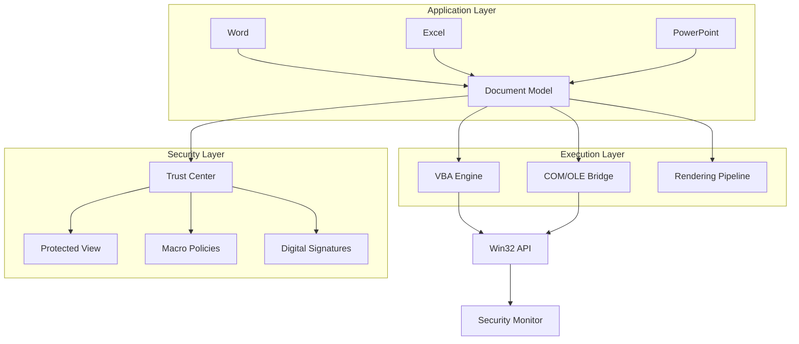
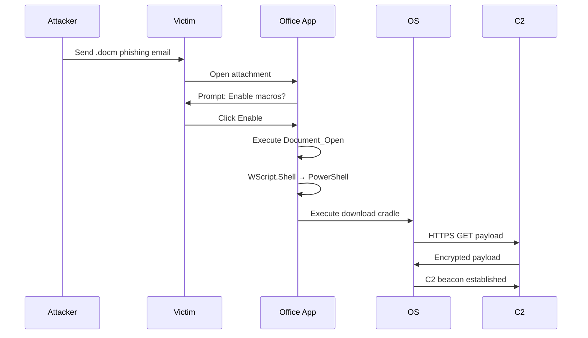

# Office Suites

## Layer Position

```
User Applications
        ↓
    OFFICE SUITES
  (Word · Excel · PowerPoint · Outlook)
        ↓
    Runtime / Libraries
  (OLE · COM · VBA Engine · .NET)
        ↓
    Operating System
  (Windows · macOS · Linux)
```

Office suites are application-layer software built on top of operating system services. They interact with the OS through COM/OLE interfaces on Windows, Cocoa on macOS, and various libraries on Linux. For cybersecurity, understanding where office suites sit is critical — they are user-space applications with deep OS integration, making them high-value attack targets.

---

## 1. Topic Overview

Office suites are integrated productivity software packages that provide tools for document creation, spreadsheet calculation, presentation design, email communication, and database management. The dominant players include Microsoft 365 (formerly Office), Google Workspace, LibreOffice, and Apple iWork. These applications process billions of documents daily across enterprise and personal environments, making them the most widely deployed software category on earth.

From a cybersecurity perspective, office suites represent one of the most dangerous attack surfaces in any organization. They process untrusted input (downloaded documents, email attachments, shared files), execute embedded code (macros, VBA scripts, ActiveX controls), handle complex file formats with decades of legacy parsing code, and maintain network connectivity for collaboration features. The combination of these factors creates a fertile ground for exploitation — document-based malware accounts for a significant percentage of all malware delivery in targeted attacks and commodity phishing campaigns alike.

Understanding office suite internals — file format structures, macro execution engines, OLE/COM integration points, and rendering pipelines — is essential for both offensive and defensive cybersecurity. Attackers leverage these features to build sophisticated delivery mechanisms; defenders must understand them to develop effective detection, prevention, and incident response strategies.

---

## 2. Why It Exists

Office suites provide standardized tools for document creation, calculation, presentation, collaboration, and data management. Without them, organizations rely on ad-hoc text files and manual computation. The tradeoff is massive complexity — Microsoft Word alone contains millions of lines of code processing dozens of formats with decades of backward compatibility. This complexity is precisely what makes office suites both essential and dangerous.

---

## 3. Internal Architecture

### 3.1 Office Suite Components

**Word Processing (Word, Writer, Google Docs)**
- Rich text editing with formatting, styles, and templates
- Table and image embedding with text wrapping algorithms
- Mail merge for bulk document generation
- Track changes and commenting for collaboration
- PDF export and OCR integration

**Spreadsheets (Excel, Calc, Google Sheets)**
- Cell-based calculation engine with formula parsing
- Dependency graph for automatic recalculation
- Data validation, conditional formatting, pivot tables
- Charting engine with vector and raster output
- VBA/macro automation layer
- External data connections (ODBC, OLE DB, REST APIs)

**Presentations (PowerPoint, Impress, Google Slides)**
- Slide-based layout engine with master slides
- Animation and transition rendering pipeline
- Embedded media playback (audio, video)
- Speaker notes and presenter view
- Export to PDF, video, and image formats

**Email Clients (Outlook, Thunderbird)**
- MAPI/Exchange protocol integration
- Calendar and contact management (MAPI store)
- Attachment handling and preview pane rendering
- Junk mail filtering and rule engines
- Public folder and shared mailbox support

**Database Tools (Access, Base)**
- GUI for table design, query building, form/report creation
- Embedded database engine (ACE/Jet for Access)
- SQL query execution and stored procedure support
- ODBC/OLE DB connectivity to external databases
- Macro and VBA integration for automation

### 3.2 File Formats

**Binary Formats (Legacy)**

| Format | Extension | Structure | Security Risk |
|--------|-----------|-----------|---------------|
| Word Binary | .doc | OLE2 Compound Document | High — complex parser, legacy code paths |
| Excel Binary | .xls | OLE2 Compound Document | High — formula injection, XLM macros |
| PowerPoint Binary | .ppt | OLE2 Compound Document | High — embedded OLE objects |
| Rich Text Format | .rtf | Text-based with control words | High — RTF exploits (CVE-2017-11882) |
| Office Macro | .docm | OLE2 with VBA project stream | Critical — macro execution |

Binary formats use the OLE2 Compound Document File Structure (also used by MS-DOC, MS-XLS). This is a sector-based filesystem-within-a-file containing named streams (WordDocument, 1Table, Data, vbaProject, etc.). The complexity of parsing these structures across 25+ years of backward compatibility creates numerous vulnerability classes.

**XML-Based Formats (Modern)**

| Format | Extension | Structure | Security Risk |
|--------|-----------|-----------|---------------|
| Office Open XML | .docx, .xlsx, .pptx | ZIP of XML files | Medium — XML parsing, embedded objects |
| Office Open XML (Macro) | .docm, .xlsm, .pptm | ZIP with vbaProject.bin | High — macro execution |
| OpenDocument | .odt, .ods, .odp | ZIP of XML files | Medium — similar attack surface |
| Flat OPC XML | .docx (unzipped) | Single XML file | Medium — XXE potential |

Modern XML formats are ZIP archives containing XML files following the Office Open XML (OOXML) standard. A .docx file contains `[Content_Types].xml`, `word/document.xml`, `word/styles.xml`, `word/_rels/document.xml.rels`, and many other parts. This structured format is easier to parse but introduces XML-specific attack vectors (XXE, billion laughs, XML bomb).

**PDF**
- PostScript-based page description language
- Can embed JavaScript, Flash, OpenType fonts
- AcroForm and XFA forms with computation
- Digital signature support (PAdES)
- Stream objects can contain compressed/encrypted content

**ODF (Open Document Format)**
- ISO standard (ISO/IEC 26300)
- ZIP of XML files similar to OOXML
- Used by LibreOffice, OpenOffice
- Supports macro scripting via Basic, Python, Java

### 3.3 Security Features

**Document Encryption**
- Office uses CryptoAPI (Windows) or platform crypto for encryption
- Default algorithm: AES-256 (Office 2013+), previously RC4 or AES-128
- Encryption key derived from user password via PBKDF2 (or older SHA-based)
- Password verification uses a hash comparison (not the actual encryption key)
- `olefile` can extract encryption metadata from OLE2 files

**Password Protection**
- **Open password**: Entire document encrypted; cannot open without correct password
- **Modify password**: Read-only by default; write access requires password
- **VBA project password**: Protects macro source code (weak — obfuscation only)
- **Sheet/workbook protection**: Prevents cell editing (not security — easily bypassed)

**Digital Signatures**
- Office uses X.509 certificates for document signing
- Signature stored in `word/_xmlsignatures/` (OOXML) or embedded in OLE2
- Validates certificate chain against Windows certificate store
- Signing does not encrypt the document — only ensures integrity and authenticity
- VBA project signing uses Authenticode (PE signature on vbaProject.bin)

**Macros and VBA**
- Visual Basic for Applications is a full scripting language embedded in Office
- VBA code stored in `vbaProject.bin` stream (OLE2) within macro-enabled documents
- Execution controlled by: macro policy (GPO), Trust Center settings, digital signature
- VBA can call Win32 API via `Declare` statements — full system access
- VBA can instantiate COM objects: `CreateObject("WScript.Shell")` for command execution

**Data Loss Prevention (DLP)**
- Microsoft 365 DLP policies scan documents for sensitive data (SSN, credit cards, etc.)
- Information Rights Management (IRM) controls document permissions after distribution
- Azure Information Protection (AIP) labels classify and protect documents
- Endpoint DLP monitors file operations (copy, print, upload) on managed devices

---

## 4. Component Breakdown

| Component | Function | Attack Surface |
|-----------|----------|----------------|
| File Parser | Reads document format | Format parsing vulnerabilities |
| Rendering Engine | Displays content (GDI+/DirectWrite) | Rendering exploits (EMF, WMF, TIFF) |
| VBA Engine | Executes macro code | Macro execution, sandbox escape |
| OLE/COM Layer | Inter-application communication | DDE, OLE object injection |
| XML Parser | Processes OOXML structures | XXE, XML injection, billion laughs |
| Template Engine | Loads document templates | Template injection (remote templates) |
| Export Module | PDF/XPS/image conversion | Export-based exploits |
| Collaboration | Real-time co-authoring | Data leakage, unauthorized access |

---

## 5. Step-by-Step Workflow

### How Word Processes a Document

```
User double-clicks .docx file
         ↓
Windows Shell invokes WINWORD.EXE with file path
         ↓
WINWORD.EXE calls CreateFile() → reads file into memory
         ↓
ZIP extraction engine decompresses .docx archive
         ↓
[Content_Types].xml parsed — maps extensions to content types
         ↓
word/_rels/document.xml.rels parsed — resolves relationships
         ↓
word/document.xml parsed — main document content loaded
         ↓
Styles, themes, fonts resolved from respective XML parts
         ↓
Images/objects loaded from word/media/ and word/embeddings/
         ↓
VBA macros checked (if .docm) — Trust Center evaluates policy
         ↓
Document rendered via GDI+/DirectWrite pipeline
         ↓
Document displayed in editing canvas
```

### How Excel Evaluates a Formula

```
User enters =SUM(A1:A10) in cell B1
         ↓
Cell reference parser tokenizes formula string
         ↓
Dependency graph updated — B1 depends on A1:A10
         ↓
Calculation engine traverses dependency chain
         ↓
SUM function retrieves values from A1:A10 cells
         ↓
Result computed and stored in B1
         ↓
Dependent cells recalculated (if any)
         ↓
Cell rendered with result and formatting
```

---

## 6. Data Flow

```
┌──────────┐    ┌────────────┐    ┌──────────────┐
│   User   │───►│  Keystroke  │───►│   Input      │
│  Input   │    │  Buffer    │    │   Processor  │
└──────────┘    └────────────┘    └──────┬───────┘
                                         ↓
                                  ┌──────────────┐
                                  │   Document   │
                                  │   Model      │
                                  │ (in-memory)  │
                                  └──────┬───────┘
                                         ↓
                           ┌─────────────┼─────────────┐
                           ↓             ↓             ↓
                    ┌────────────┐ ┌──────────┐ ┌──────────┐
                    │  Rendering │ │  Export  │ │  Auto-   │
                    │  Engine    │ │  Module  │ │  Save    │
                    └────────────┘ └──────────┘ └──────────┘
                           ↓             ↓             ↓
                    ┌────────────┐ ┌──────────┐ ┌──────────┐
                    │  Display   │ │  File    │ │  Temp    │
                    │  Output    │ │  System  │ │  Files   │
                    └────────────┘ └──────────┘ └──────────┘
```

**Security-relevant data flows:**
1. Remote templates loaded over HTTP/S from URLs in `word/_rels/document.xml.rels`
2. OLE objects fetched from remote servers via DDE links
3. VBA macros execute code that reads/writes filesystem and network
4. Collaboration features upload document content to cloud services
5. DLP agents scan document content before allowing file operations

---

## 7. Control Flow

```
┌─────────────────────────────────────────────────┐
│               Office Application                 │
│                                                  │
│  ┌──────────┐   ┌──────────┐   ┌──────────┐    │
│  │  Message │──►│ Document │──►│ Rendering│    │
│  │   Loop   │   │  Model   │   │ Pipeline │    │
│  │ (WndProc)│   │          │   │          │    │
│  └──────────┘   └──────────┘   └──────────┘    │
│       ↑              ↑              ↑           │
│       │              │              │           │
│  ┌──────────┐   ┌──────────┐   ┌──────────┐    │
│  │  Event   │   │   VBA    │   │   GDI/   │    │
│  │ Handler  │   │  Engine  │   │DirectX   │    │
│  └──────────┘   └──────────┘   └──────────┘    │
│       ↑              ↑                          │
│       │         ┌────┴────┐                     │
│       │         │   COM   │                     │
│       │         │  Bridge │                     │
│       │         └────┬────┘                     │
│       │              │                          │
└───────┼──────────────┼──────────────────────────┘
        │              │
   ┌────┴────┐   ┌─────┴─────┐
   │  User   │   │  OS/COM   │
   │  Input  │   │  Services │
   └─────────┘   └───────────┘
```

**Control flow security implications:**
- The Windows message loop processes all input events, including crafted mouse/keyboard messages
- VBA engine runs in the same process as the Office application — no isolation
- COM calls can cross process boundaries (OLE automation)
- Event handlers (Document_Open, Auto_Open) execute code on file open
- Add-ins hook into the message loop and execute in-proc

---

## 8. Memory Flow

Office applications use a virtual address space containing text/data (code, read-only data), heap memory (dynamic allocations), stack (local variables, call frames), OLE/COM objects (in-process servers), and memory-mapped files (documents loaded via `mmap`/`CreateFileMapping`).

**OLE Object Memory Handling:**
- OLE objects instantiated via `OleCreate` / `OleCreateFromFile` — embedded objects run in the same process
- `IStorage` and `IStream` interfaces manage compound document storage
- Memory-mapped files used for large document loading

**Security implications:**
- VBA engine allocates executable memory for compiled macro code
- Heap spraying via document objects can position shellcode
- Use-after-free in rendering objects leads to code execution
- Buffer overflows in font parsing (TrueType, OpenType) exploit stack/heap
- ASLR effectiveness depends on Office DLL base address randomization

---

## 9. Hardware Interaction

Office suites interact with hardware through OS abstractions. Key interactions: CPU (instruction execution, VBA JIT compilation), RAM (document model storage — memory scraping, cold boot attacks), GPU (DirectWrite/Direct2D rendering — GPU-based attacks), Storage (file I/O, temp files — forensic artifacts), NIC (cloud sync, collaboration — exfiltration channels), Printer (EMF/PostScript generation — print spooler exploits), Clipboard (copy/paste — hijacking, data exfiltration), TPM (BitLocker, attestation — secure document access).

---

## 10. Operating System Interaction

Office on Windows has the deepest OS integration via WINWORD.EXE → VBA DLL (vbe7.dll) + MSO.dll (Office Core) → COM/OLE32.dll → Win32 API/NTDLL → Windows Kernel.

**Key integration points:**
- **Registry**: HKCU\Software\Microsoft\Office stores all settings
- **COM Registration**: OLE servers registered in HKCR
- **Group Policy**: Macro policies, trust locations, trusted publishers
- **Windows Event Log**: Office audit events (Event IDs 4688, etc.)
- **AppLocker/SRP**: Can block Office executables and scripts
- **AMSI**: Windows Defender scans VBA macro code at runtime

**macOS**: Office apps signed with Apple Developer ID; Gatekeeper checks notarization; AppleScript replaces VBA for automation. **Linux (LibreOffice)**: X11/Wayland display, UNO bridge (similar to COM), D-Bus IPC.

---

## 11. Network Interaction

Office clients communicate with cloud services (SharePoint, OneDrive, Google Docs) via HTTPS, local networks via SMB/CIFS, using OAuth/SAML authentication. Network features include AutoSave (continuous upload), co-authoring (real-time editing via WebSocket), remote templates (HTTP URLs in document relationships), and connected experiences (cloud analysis of content).

**Data exfiltration via Office:**
- VBA macros make HTTP requests via `MSXML2.XMLHTTP` or `WinHttp.WinHttpRequest.5.1`
- DDE links reference UNC paths (`\\attacker\share`) or HTTP URLs
- OLE objects load remote content; hyperlinks redirect to attacker servers
- Cloud sync automatically exfiltrates document content

---

## 12. Security Perspective

### Macro Malware (VBA-based Attacks)

**Attack Chain:**
```
Phishing Email with .docm attachment
         ↓
User enables macros (social engineering)
         ↓
Document_Open / Auto_Open executes
         ↓
VBA code runs: CreateObject("WScript.Shell")
         ↓
PowerShell/curl downloads payload from C2
         ↓
Payload executed: info stealer, ransomware, RAT
         ↓
Persistence: scheduled task, registry key, startup folder
```

**Common VBA payloads:**
- `Shell("powershell -enc <base64>")` — obfuscated PowerShell
- `CreateObject("Scripting.FileSystemObject")` — file system access
- `CreateObject("WScript.Shell")` — process execution
- `Declare PtrSafe Function` — Win32 API calls (VirtualAlloc, CreateThread)
- Auto-open macros in Excel (`Workbook_Open`) for spreadsheet-based attacks

### Document Exploits

**Vulnerability classes in Office:**
- **Buffer overflow in parsers**: CVE-2017-11882 (Equation Editor), CVE-2022-30190 (Follina)
- **Use-after-free in rendering**: Crafted objects trigger UAF when displayed
- **Integer overflow in format parsing**: Malformed fields cause size miscalculation
- **Logic bugs in OLE handling**: Incomplete validation of embedded objects
- **Font parsing vulnerabilities**: TrueType/OpenType parser bugs
- **RTF exploit chains**: `{\*\shppict` constructs trigger EMF/WMF parsing bugs

### Phishing via Office Documents

- **Template injection**: Remote template URLs in document relationships
- **OLE object injection**: Embedded objects with malicious content
- **DDE exploitation**: Dynamic Data Exchange commands embedded in documents
- **Hyperlink-based phishing**: Redirects to credential harvesting pages
- **QR code injection**: Embedded QR codes leading to malicious URLs
- **Metadata-based social engineering**: Author names, company info lend credibility

---

## 13. Attack Surface

| Attack Vector | Method | Detection Difficulty | Impact |
|--------------|--------|---------------------|--------|
| Macro malware | VBA code execution | Medium (AMSI, behavior) | Critical |
| Document exploits | Parser/rendering bugs | Hard (signature-based) | Critical |
| Template injection | Remote template loading | Medium | High |
| DDE attacks | Dynamic Data Exchange | Easy-Medium | High |
| OLE embedding | Embedded objects | Medium | High |
| Phishing links | Hyperlink redirects | Easy | Medium-High |
| QR code phishing | Embedded QR codes | Hard | Medium-High |
| Metadata exfiltration | Author, comments, revision history | Easy | Medium |
| Auto-extracting archives | ZIP with Office files | Medium | High |
| Supply chain | Compromised templates/add-ins | Very Hard | Critical |

**Hidden attack surfaces:**
- Excel 4.0 (XLM) macros — legacy macro system, bypasses VBA detection
- OneNote files — embedded files (`.one` format hosts embedded executables)
- Publisher files — `.pub` format with OLE support
- Visio files — `.vsd` with macro and embedding support
- PowerPoint animations — trigger code execution on slide transition

---

## 14. Defensive Perspective

### Macro Security Controls

**GPO**: `User Config → Admin Templates → Microsoft Office → Security → VBA Macro Notification Settings` — options: disable all, disable with notification (default), disable unsigned, enable all.

**ASR Rules**: Block Office from creating child processes, creating executable content, injecting code into other processes, and communication apps from spawning children.

### Detection

**YARA for macros**: Match on `VBA_PROJECT`/`ThisDocument` strings combined with `Auto_Open`/`Document_Open` or suspicious strings (`WScript.Shell`, `PowerShell`, `cmd.exe`).

**File format validation**: `olefile` for OLE2, `olevba` for VBA extraction, decompress OOXML and inspect `.rels` for remote templates, validate digital signatures.

### Endpoint Protection

- AMSI for real-time VBA scanning
- AppLocker/WDAC restricting Office child process creation
- Protected View for internet/untrusted files
- Disable ActiveX for untrusted documents
- Windows Defender Exploit Guard for Office mitigations

---

## 15. Debugging Perspective

**Tools**: WinDbg (crash analysis), x64dbg/OllyDbg (user-mode), Process Monitor (file/registry/network), API Monitor (API tracing), Wireshark (network capture).

**Debugging workflow**: Attach debugger to WINWORD.EXE → set breakpoints on VirtualAlloc/CreateThread → open malicious document → observe macro execution → extract IOCs (URLs, file paths, registry keys).

**Crash analysis**: Analyze WER files → load dump in WinDbg → `!analyze -v` → identify faulting module and exception code → examine call stack → determine root cause (parsing bug, UAF, overflow).

---

## 16. Reverse Engineering Perspective

### Static Analysis Tools

| Tool | Purpose | Command |
|------|---------|---------|
| `olevba` | Extract VBA macros | `olevba malicious.docm` |
| `olefile` | Parse OLE2 structures | `olefile.OleFileIO('f.doc').listdir()` |
| `rtfobj` | Extract OLE from RTF | `rtfobj malicious.rtf` |
| `pdfid` | PDF indicators | `pdfid suspicious.pdf` |
| `strings` | Readable strings | `strings -n 8 suspicious.doc` |

### Dynamic Analysis

Create isolated VM (no network, snapshot) → start ProcMon + Wireshark/FakeNet-NG → open document → observe child processes, files created, network connections → dump payloads → extract IOCs (URLs, IPs, hashes).

### VBA Deobfuscation

Common evasion: `Chr()` string concatenation, Base64 encoding, `Environ()` expansion, RTLO characters, encoded strings in document properties.

**Suspicious VBA patterns**: `Shell()` with encoded params, `CreateObject("WScript.Shell")`, `MSXML2.XMLHTTP`, `VirtualAlloc`/`CreateThread` (shellcode injection), `Auto_Open`/`Document_Open`.

**Suspicious OLE patterns**: Package objects (embedded executables), remote template references, DDE field codes, OLE links to UNC/HTTP.

---

## 17. Flowcharts

```
         ┌─────────────┐
         │  Open File   │
         └──────┬──────┘
                ↓
         ┌─────────────┐
         │  Detect     │
         │  Format     │
         └──────┬──────┘
                ↓
    ┌───────────┼───────────┐
    ↓           ↓           ↓
┌───────┐ ┌─────────┐ ┌─────────┐
│ OLE2  │ │  OOXML  │ │   PDF   │
│Parser │ │ Parser  │ │ Parser  │
└───┬───┘ └────┬────┘ └────┬────┘
    └──────────┼───────────┘
               ↓
        ┌─────────────┐
        │  Validate   │
        │  Structures │
        └──────┬──────┘
               ↓
        ┌─────────────┐     ┌─────────────┐
        │  Check for  │────►│ Execute     │
        │  Macros     │     │ Macros      │
        └──────┬──────┘     └─────────────┘
               ↓
        ┌─────────────┐
        │  Build      │
        │  Document   │
        │  Model      │
        └──────┬──────┘
               ↓
        ┌─────────────┐
        │  Render     │
        │  to Screen  │
        └─────────────┘
```

---

## 18. Mermaid Diagrams

### Office Suite Architecture



### Document-Based Attack Kill Chain



---

## 19. Practical Examples

### Example 1: Extracting VBA Macros

```bash
pip install oletools
olevba malicious.docm          # Extract VBA source
olevba --deobf malicious.docm  # With deobfuscation hints
yara -r office_rules.yar malicious.docm  # YARA scan
```

### Example 2: Analyzing OOXML Structure

```bash
unzip document.docx -d /tmp/docx_analysis/
cat /tmp/docx_analysis/[Content_Types].xml
cat /tmp/docx_analysis/word/_rels/document.xml.rels  # Check for remote templates
grep -r "Target=" /tmp/docx_analysis/word/_rels/
ls -la /tmp/docx_analysis/word/embeddings/           # Embedded objects
```

### Example 3: Sysmon for Macro Detection

```xml
<Sysmon>
  <EventFiltering>
    <ProcessCreate onmatch="include">
      <Image condition="is">C:\Windows\System32\cmd.exe</Image>
      <ParentImage condition="end with">WINWORD.EXE</ParentImage>
    </ProcessCreate>
    <CreateRemoteThread onmatch="include">
      <SourceImage condition="end with">WINWORD.EXE</SourceImage>
    </CreateRemoteThread>
  </EventFiltering>
</Sysmon>
```

---

## 20. Hands-on Labs

### Lab 1: Analyze a Macro-Enabled Document (30 min)

**Objective**: Extract and analyze VBA macros from a sample document.

1. Create a simple macro in Word: `Sub Auto_Open() : MsgBox "Hello" : End Sub`
2. Save as .docm (macro-enabled)
3. Run `olevba yourfile.docm` — observe extracted VBA source
4. Modify the macro to use `Shell("calc.exe")` — observe how olevba identifies suspicious patterns
5. Use `olefile` to list all OLE streams and examine the `vbaProject.bin` stream structure

### Lab 2: Template Injection Detection (20 min)

**Objective**: Identify remote template references in an OOXML document.

1. Create a .docx file in Word, unzip: `unzip document.docx -d /tmp/docx/`
2. Examine `/tmp/docx/word/_rels/document.xml.rels` for relationship types and targets
3. Search for any `External` references or HTTP URLs
4. Create a PoC by adding a remote template reference in the .rels file
5. Observe how Word attempts to load the remote template

### Lab 3: Office Process Monitoring (25 min)

**Objective**: Monitor Office application behavior using Process Monitor.

1. Open Process Monitor with filter: `Process Name contains WINWORD`
2. Open a normal Word document — observe file I/O, registry access, network operations
3. Create a document with macro: `Shell("cmd /c whoami > C:\temp\output.txt")`
4. Open with macros enabled — identify the process chain (WINWORD → cmd.exe → whoami)
5. Document the complete execution flow with timestamps

---

## 21. Interview Questions

1. **What is the difference between .doc and .docx?**
   .doc is binary OLE2 Compound Document format; .docx is Office Open XML (ZIP of XML files). OOXML introduces XML-specific attack vectors (XXE).

2. **What is Protected View?**
   Opens documents from untrusted locations (internet, email) in a restricted sandbox preventing code execution until user explicitly trusts the document.

3. **What is template injection?**
   Attackers modify `word/_rels/document.xml.rels` to reference an external template via HTTP. Word downloads it on open, executing malicious macros or DDE fields.

4. **What is DDE and how is it exploited?**
   Dynamic Data Exchange is a legacy IPC protocol. Attackers embed DDE fields in documents that execute commands on open, bypassing macro security controls.

5. **How does AMSI help protect against Office attacks?**
   AMSI provides a standard interface for antimalware to inspect VBA macro code at runtime before execution, enabling real-time detection.

6. **Describe the macro-based attack kill chain.**
   Phishing email → user opens .docm → enables macros → Document_Open fires → WScript.Shell → PowerShell downloads payload → persistence → C2 beacon.

7. **What are XLM macros and why are they dangerous?**
   Excel 4.0 legacy macros using cell-based formulas (`=EXEC()`, `=RUN()`). They bypass VBA-specific detection (limited AMSI integration) and hide in Excel-only documents.

8. **How would you detect malicious Office documents in an enterprise?**
   Layered: AMSI for VBA scanning, ASR rules blocking Office child processes, Sysmon process monitoring, network monitoring for HTTP/UNC from Office, YARA at email gateway, sandbox detonation.

---

## 22. Knowledge Check

1. Name three ways an Office document can execute code without VBA macros.
   — DDE fields, template injection, OLE object embedding

2. What file structure do .doc, .xls, and .ppt use?
   — OLE2 Compound Document File Structure

3. What is `vbaProject.bin`?
   — Contains compiled VBA macro source code as an OLE2 stream

4. How does signing differ from encryption?
   — Signing ensures integrity/authenticity; encryption ensures confidentiality

5. You receive a .docx triggering PowerShell execution. What artifacts do you examine?
   — Event Logs (4688), Sysmon, PowerShell transcripts, Office temp files, network logs

6. Can attackers bypass macro-blocking Group Policy? How?
   — Yes: DDE execution, template injection, OLE embedding, RTF exploits, OneNote embedded files

---

## 23. Summary

Office suites are the most deployed software category and one of the most exploited attack surfaces. Key takeaways:

- **Office documents are code execution platforms**: Macros, DDE, OLE, template injection, and embedded objects all execute code beyond simple display
- **File format complexity creates vulnerabilities**: Decades of OLE2/OOXML backward compatibility produce a massive parser attack surface
- **Social engineering drives delivery**: Most attacks require user interaction — enabling macros, clicking links, or ignoring warnings
- **Defense requires layering**: Combine macro policies, ASR rules, AMSI, network monitoring, sandboxing, and user education
- **The attack surface evolves**: New formats (OneNote), legacy features (XLM macros), and cloud attacks expand the threat landscape

---

## 24. Preview of the Next Topic

**Next: Networking Basics**

Having covered the hardware foundation and application layer, we now descend into the infrastructure that connects systems — networking. The next topic covers network fundamentals: the OSI and TCP/IP models, IP addressing, subnetting, common protocols (TCP, UDP, HTTP, DNS, ARP), and how data traverses networks. Understanding networking is essential for cybersecurity because virtually all modern attacks traverse network infrastructure — from phishing emails delivered via SMTP to C2 traffic over HTTPS. We will examine network architecture, common attack vectors (man-in-the-middle, DNS spoofing, packet sniffing), and the defensive technologies (firewalls, IDS/IPS, network segmentation) that protect organizational infrastructure.

The transition from office suites to networking is natural: office documents travel over networks, cloud collaboration depends on network protocols, and the exfiltration paths we identified in Section 11 all require network connectivity. Networking is the connective tissue of modern computing — and a primary battlefield for cybersecurity operations.

---

*This document is part of the ApnaSite CyberSecurity curriculum. All content is for educational purposes only.*
