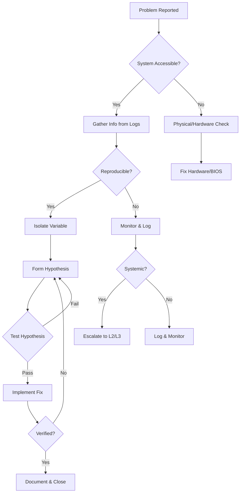
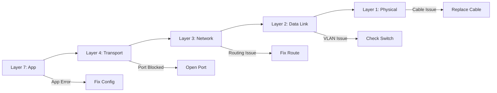

# Troubleshooting

## Layer Position

```
┌─────────────────────────────────────────────────────┐
│              TROUBLESHOOTING FRAMEWORK               │
│  Identify → Isolate → Diagnose → Resolve → Verify   │
└─────────────────────────────────────────────────────┘
        ▲               │               ▼
┌───────┴───────┐ ┌─────┴─────┐ ┌───────┴───────┐
│  Hardware     │ │ Software  │ │   Network     │
│  CPU · RAM    │ │  OS       │ │  TCP/IP       │
│  Storage · NIC│ │  Apps     │ │  DNS · HTTP   │
└───────────────┘ └───────────┘ └───────────────┘
        ▲               │               ▼
┌───────┴───────┐ ┌─────┴─────┐ ┌───────┴───────┐
│   Physical    │ │  Logical  │ │  Security     │
│   Layer       │ │  Layer    │ │  Layer        │
└───────────────┘ └───────────┘ └───────────────┘
```

---

## 1. Topic Overview

Troubleshooting is the systematic methodology of identifying, isolating, diagnosing, and resolving failures across the full technology stack. In cybersecurity, troubleshooting extends beyond restoring functionality — it encompasses forensic preservation, attack vector identification, and root cause analysis to prevent recurrence. Every incident response engagement begins with troubleshooting: determining what happened, how it happened, and what is still compromised.

Effective troubleshooting requires mastery of multiple domains simultaneously. A network outage may be caused by a hardware fault, a misconfigured firewall rule, a DNS poisoning attack, or a CPU exhausting itself in a cryptomining loop. The troubleshooter must traverse layers of abstraction — from electrical signals on a wire to application-layer protocol semantics — to identify the true root cause. This is structured reasoning guided by methodology, tools, and experience.

---

## 2. Why It Exists

Troubleshooting exists because systems fail — inevitably, unpredictably, and often in cascading ways. Without structured troubleshooting, root causes are misidentified, forensic evidence is destroyed by premature remediation, and repeat incidents occur because the actual failure vector was never documented.

---

## 3. Internal Architecture

### 3.1 Troubleshooting Methodologies

#### CompTIA A+ 7-Step Process

| Step | Action | Key Question |
|------|--------|-------------|
| 1 | Identify the problem | "What changed recently?" |
| 2 | Establish theory of probable cause | "One thing or many?" |
| 3 | Test the theory | "Can I reproduce it?" |
| 4 | Establish plan of action | "What is the rollback plan?" |
| 5 | Implement solution or escalate | "Do I have change approval?" |
| 6 | Verify full system functionality | "Any regressions?" |
| 7 | Document findings and actions | "Will this prevent recurrence?" |

#### OSI Model Layered Approach

| Layer | Check |
|-------|-------|
| 7 (Application) | App logs, API responses, DNS resolution |
| 6 (Presentation) | Encoding, encryption, compression |
| 5 (Session) | Session state, authentication tokens |
| 4 (Transport) | TCP/UDP, port availability, firewalls |
| 3 (Network) | Routing, IP addressing, subnets |
| 2 (Data Link) | MAC addresses, switch ports, VLANs |
| 1 (Physical) | Cables, LEDs, power, hardware faults |

#### Divide and Conquer

```
Start at Layer 3 → Can you ping the server?
  ├── YES → Problem above L3 → Check L4 (port open?)
  │           ├── YES → Check L7 (app running?)
  │           └── NO → Firewall or service issue
  └── NO → Problem at or below L3 → Check L1 (cable?)
              ├── YES → Check L2 (ARP resolving?)
              └── NO → Physical issue
```

### 3.2 Diagnostic Tools

**Hardware:**
| Tool | Purpose | Command |
|------|---------|---------|
| `memtest86+` | RAM testing | Boot from USB, 4+ passes |
| `smartctl` | Storage SMART data | `smartctl -a /dev/sda` |
| `stress-ng` | Stress testing | `stress-ng --cpu 4 --vm 2` |
| `fio` | I/O benchmarking | `fio --name=test --rw=randread --bs=4k` |

**Software:**
| Tool | Purpose | Command |
|------|---------|---------|
| `strace` | System call tracing | `strace -p <PID> -e trace=network` |
| `lsof` | Open files | `lsof -p <PID>` |
| `dmesg` | Kernel messages | `dmesg -T \| tail -50` |
| `vmstat` | Memory stats | `vmstat 1 10` |
| `iostat` | Disk I/O | `iostat -xz 1 5` |

**Network:**
| Tool | Purpose | Command |
|------|---------|---------|
| `tcpdump` | Packet capture | `tcpdump -i eth0 -nn port 443` |
| `nmap` | Port scanning | `nmap -sV -sC -O target` |
| `dig` | DNS check | `dig @8.8.8.8 example.com A` |
| `mtr` | Path analysis | `mtr --report 8.8.8.8` |
| `iperf3` | Bandwidth test | `iperf3 -c target -t 30` |

### 3.3 Common Problem Categories

| Category | Examples | Key Diagnostic |
|----------|----------|----------------|
| Hardware | RAM failure, disk errors, PSU issues | `memtest86+`, `smartctl`, POST codes |
| Software | Driver conflicts, memory leaks, deadlocks | `strace`, `valgrind`, `dmesg` |
| Network | DNS failure, routing issues, port blocks | `dig`, `traceroute`, `nmap` |
| Security | Malware, exfiltration, brute force | AV scan, packet capture, log analysis |

---

## 4. Component Breakdown

| Component | Diagnostic Tools | Failure Indicators |
|-----------|-----------------|-------------------|
| CPU | `top`, `mpstat`, `/proc/cpuinfo` | High steal%, thermal throttling |
| RAM | `free -h`, `vmstat`, `memtest86+` | OOM kills, ECC errors |
| Storage | `df -h`, `iostat`, `smartctl` | High await, SMART warnings |
| NIC | `ethtool`, `ip -s link`, `tcpdump` | Link flaps, CRC errors |
| PSU | `sensors`, multimeter | Voltage fluctuation, shutdowns |
| Motherboard | `dmidecode`, POST codes | Beep codes, failed POST |

---

## 5. Step-by-Step Workflow

```
1. TRIAGE
   ├── Assess severity (P1-P4)
   ├── Determine blast radius
   └── Can we afford to reboot?

2. PRESERVE EVIDENCE (if security incident)
   ├── Memory dump: dd if=/dev/mem of=memdump.bin
   ├── Disk image: dd if=/dev/sda of=disk.img bs=4M
   ├── Network capture: tcpdump -w evidence.pcap
   └── Document timestamps and chain of custody

3. GATHER INFORMATION
   ├── User reports: What changed? When started?
   ├── System logs: syslog, auth.log, dmesg
   ├── Performance metrics: CPU, RAM, disk, network
   └── Recent changes: patches, configs, new installs

4. ISOLATE THE PROBLEM
   ├── Identify affected scope (single host? subnet? all?)
   ├── Determine which OSI layer is affected
   ├── Check if reproducible
   └── Document exact error messages

5. DEVELOP THEORY
   ├── Most likely cause based on symptoms
   ├── Least disruptive fix first
   └── Consider: hardware, software, config, security

6. TEST THEORY
   ├── Test in non-production if possible
   ├── Create rollback plan before implementing
   └── Document test results

7. IMPLEMENT SOLUTION
   ├── Execute with change control
   ├── Monitor during implementation
   └── Verify resolution immediately

8. VERIFY & CLOSE
   ├── Confirm original symptom resolved
   ├── Check for regressions
   ├── Update documentation
   └── Close ticket with audit trail
```

---

## 6. Data Flow

```
Hardware (CPU perf counters, RAM ECC errors, Disk SMART logs)
    │
    ▼
Kernel (sysfs, /proc, dmesg, perf_events)
    │
    ▼
OS (systemd journal, syslog, auditd)
    │
    ▼
Application (app logs, metrics, traces)
    │
    ▼
Collection (Fluentd, Logstash, Prometheus)
    │
    ▼
Analysis (Splunk, ELK, Grafana)
    │
    ▼
Human (Triage, Correlation, Decision)
```

**Key cybersecurity data sources:**
- **Endpoint**: EDR telemetry, Sysmon logs, Windows Event Logs
- **Network**: NetFlow, packet captures, firewall/IDS logs
- **Identity**: AD logs, LDAP, Kerberos events
- **Cloud**: CloudTrail (AWS), Activity Log (Azure), Audit Log (GCP)

---

## 7. Control Flow

```
Problem Reported
       │
       ▼
┌──────────────┐
│ System in    │──YES──► Preserve evidence first
│ production?  │         │
└──────┬───────┘         ▼
       │NO         Continue troubleshooting
       ▼
┌──────────────┐
│ Reproducible?│──NO──► Monitor & Log
└──────┬───────┘
       │YES
       ▼
┌──────────────┐
│ Isolate      │
│ Variable     │
└──────┬───────┘
       │
       ▼
┌──────────────┐
│ Hypothesize  │
│ Root Cause   │
└──────┬───────┘
       │
       ▼
┌──────────────┐
│ Test         │──FAIL──► New Hypothesis
│ Hypothesis   │          (loop back)
└──────┬───────┘
       │PASS
       ▼
┌──────────────┐
│ Implement    │
│ Fix          │
└──────┬───────┘
       │
       ▼
┌──────────────┐
│ Verified?    │──NO──► Rollback & Reassess
└──────┬───────┘
       │YES
       ▼
┌──────────────┐
│ Document     │
│ & Close      │
└──────────────┘
```

---

## 8. Memory Flow

```bash
# Step 1: Check current usage
$ free -h
# High swap usage → OOM risk

# Step 2: Identify top consumers
$ ps aux --sort=-%mem | head -10

# Step 3: Check for leaks
$ valgrind --leak-check=full ./app
$ pmap -x <PID> | sort -k3 -n -r

# Step 4: Check kernel memory
$ slabtop -o
$ dmesg | grep -i "oom\|out of memory"

# Step 5: Hardware test
$ dmidecode -t memory | grep -i error
# Boot memtest86+ for thorough test
```

**Security perspective:** Volatile memory contains encryption keys, passwords, decrypted data. Cold boot attacks extract remnant data. AMD SME/SEV and Intel TME provide hardware memory encryption.

---

## 9. Hardware Interaction

```
Level 1: Visual Inspection
  ├── Bulging capacitors, spinning fans, cable connections
  └── POST LEDs, listen for clicking HDD

Level 2: BIOS/UEFI Diagnostics
  ├── Built-in hardware tests
  ├── Temperature and voltage monitoring
  └── Device detection verification

Level 3: OS-Level Diagnostics
  ├── CPU: mpstat, sensors
  ├── RAM: memtest86+, dmidecode
  ├── Disk: smartctl, badblocks
  ├── NIC: ethtool, dmesg
  └── GPU: nvidia-smi, lspci

Level 4: Component Isolation
  ├── Swap components between known-good systems
  ├── Minimal configuration testing
  └── POST card for no-display issues
```

---

## 10. Operating System Interaction

**Linux:**
```bash
uname -a                      # Kernel version
ps auxf                       # Process tree
strace -p <PID> -c            # Syscall summary
systemctl --failed             # Failed services
journalctl -u <svc> --since "1 hour ago"
```

**Windows:**
```powershell
systeminfo
Get-WinEvent -FilterHashtable @{LogName='Security';ID=4625}
Get-Process | Sort-Object CPU -Descending | Select -First 10
Get-Service | Where-Object {$_.Status -ne 'Running'}
```

---

## 11. Network Interaction

```
Layer 1: Physical → Cable, LEDs, ethtool link detection
Layer 2: Data Link → ARP table, MAC table, VLAN assignment
Layer 3: Network → IP config, routing table, ping gateway
Layer 4: Transport → Port listening, TCP states, NAT tables
Layer 7: Application → DNS, HTTP status, TLS handshake
```

```bash
# Connectivity test progression
ping <gateway>          # L3: Can reach router?
traceroute <dest>       # L3: Where path breaks?
ss -tlnp                # L4: Service listening?
dig <domain>            # L7: DNS resolving?
curl -I <url>           # L7: HTTP responding?
```

---

## 12. Security Perspective

```
CRITICAL RULE: PRESERVE EVIDENCE BEFORE TROUBLESHOOTING
  1. Do NOT reboot (volatile data lost)
  2. Do NOT run AV scans yet
  3. Capture volatile data FIRST
  4. Document everything with timestamps

Volatile Data Capture Order:
  1. netstat -anop        (network connections)
  2. ps auxwwwf            (running processes)
  3. dd if=/dev/mem        (memory dump)
  4. tcpdump -w evidence.pcap (network capture)
  5. lsof -n               (open files)
  6. date -u               (system time)
  7. w                     (logged-in users)
  8. ip route              (routing table)
  9. arp -a                (ARP cache)
  10. lsmod                (kernel modules)
```

---

## 13. Attack Surface

**Anti-Forensics Techniques:**

| Technique | Description | Detection |
|-----------|-------------|-----------|
| Log deletion | Remove evidence from logs | Log integrity monitoring (AIDE, Tripwire) |
| Timestomping | Modify file timestamps | Compare $STANDARD_INFORMATION vs $FILE_NAME |
| Process hollowing | Inject code into legitimate processes | EDR behavioral detection |
| Log poisoning | Inject fake entries | Cross-reference multiple log sources |
| LOLBins | Use legitimate tools maliciously | Behavioral analysis, command-line logging |

**Hidden persistence mechanisms:**
```bash
# Windows
HKLM\Software\Microsoft\Windows\CurrentVersion\Run
schtasks /query
Get-WMIObject -Namespace root\Subscription -Class __EventFilter

# Linux
/var/spool/cron/  /etc/crontab
systemctl list-timers --all
/etc/ld.so.preload
rpm -Va  # Verify system binary integrity
```

---

## 14. Defensive Perspective

**Alert Triage:**
- True positive or false positive?
- Blast radius? Is attacker still active?
- What data/systems at risk?

**Containment Checklist:**
- Isolate affected host (network quarantine)
- Disable compromised accounts
- Block IOCs at firewall/proxy
- Preserve evidence before remediation

**Investigation Tools:**
- `Volatility` — Memory forensics
- `YARA` — Malware signature scanning
- `osquery` — SQL-based endpoint queries
- `Velociraptor` — Endpoint visibility
- `Zeek` — Network security monitoring

---

## 15. Debugging Perspective

```bash
# GDB for crash/malware analysis
gdb -p <PID>
(gdb) bt                    # Backtrace
(gdb) info registers         # CPU state

# Behavior tracing
strace -f -e trace=network -p <PID>
ltrace -p <PID>

# Volatility memory forensics
volatility -f mem.dump imageinfo
volatility -f mem.dump --profile=Win7SP1x64 pslist
volatility -f mem.dump --profile=Win7SP1x64 netscan

# Binary analysis
strings <suspicious_file> | head -50
objdump -d <binary> | head -100
file <binary>
```

---

## 16. Reverse Engineering Perspective

**Static Analysis (Without Execution):**
```bash
file suspicious.exe                          # Identify type
strings -n 6 suspicious.exe | grep -i http   # Extract strings
yara -r rules/ suspicious.exe                # Signature check
objdump -p suspicious.exe | grep -A50 "Import"  # Imports
```

**Dynamic Analysis (With Execution):**
- Run in isolated sandbox/VM
- Monitor file system: `procmon` (Win) / `inotifywait` (Linux)
- Monitor network: `tcpdump -i any -w capture.pcap`
- Monitor registry: `regshot` (Windows)

**Common Malware Indicators:**
- Packed/encrypted sections
- Anti-VM / anti-debug checks
- Process injection patterns
- DNS requests to DGA-generated domains
- Registry persistence modifications

---

## 17. Flowcharts

### Quick Triage Flowchart

```
Problem Reported
       │
       ▼
  System Accessible? ──NO──► Physical/Hardware Check
       │YES                           │
       ▼                              ▼
  Check Logs & Metrics          Fix Hardware/BIOS
       │
       ▼
  SSH In? ──NO──► Network Check Remotely
       │YES
       ▼
  Run Diagnostic Commands
       │
       ▼
  Identify Root Cause
       │
       ▼
  Implement Fix
       │
       ▼
  Verify & Document
```

---

## 18. Mermaid Diagrams





---

## 19. Practical Examples

### Example 1: Cryptominer Consuming CPU

```bash
$ uptime
 load average: 12.5, 11.2, 10.8

$ top -bn1 | head -5
%Cpu(s): 95.2 us, 2.1 sy, 0.0 ni, 1.8 id

$ ps aux --sort=-%cpu | head -5
root 8834 94.0 2.1 /usr/bin/java -jar cryptominer.jar

# Resolution: Kill process, investigate compromise vector,
# check persistence, scan for malware
```

### Example 2: Brute Force Attack

```bash
$ grep "Failed password" /var/log/auth.log | \
  awk '{print $11}' | sort | uniq -c | sort -rn | head -5
  15842 10.0.0.50

$ grep "Accepted password" /var/log/auth.log | grep "10.0.0.50"
  → 3 successful logins found!

# Resolution: Block IP, reset passwords, implement fail2ban,
# enable MFA, review account permissions
```

### Example 3: DNS Tunneling Detection

```bash
$ tshark -r capture.pcap -Y "dns" -T fields \
  -e dns.qry.name | awk '{print length, $0}' | sort -rn | head -10
  → Long DNS queries indicate DNS tunneling

# Resolution: Block C2 domain, investigate compromised host,
# review data exfiltration volume
```

---

## 20. Hands-on Labs

### Lab 1: Memory Dump Analysis

```bash
$ sudo dd if=/dev/mem of=/evidence/memdump.raw bs=1M count=4096
$ volatility -f /evidence/memdump.raw imageinfo
$ volatility -f /evidence/memdump.raw --profile=LinuxProfile linux_pslist
$ volatility -f /evidence/memdump.raw --profile=LinuxProfile linux_netscan
```

### Lab 2: Log Correlation Timeline

```bash
$ grep "10.0.0.50" /var/log/auth.log /var/log/syslog /var/log/apache2/access.log | \
  sort -k3 -t: > /evidence/timeline.txt

# Visualize activity pattern
$ cat /evidence/timeline.txt | \
  awk '{print $3}' | cut -d: -f1,2 | uniq -c | \
  awk '{printf "%s ", $2; for(i=0;i<$1/10;i++) printf "#"; print ""}'
```

---

## 21. Interview Questions

### Beginner (5)

1. **What are the 7 steps of CompTIA A+ troubleshooting?**
   Identify → Theory → Test → Plan → Implement → Verify → Document.

2. **Difference between `ping` and `traceroute`?**
   `ping` tests end-to-end connectivity. `traceroute` shows each hop to identify where path breaks.

3. **How do you check if a port is open?**
   `nmap -p <port> <host>`, `nc -zv <host> <port>`, or `telnet <host> <port>`.

4. **What does `%util` in `iostat` mean?**
   Percentage of time disk was busy with I/O. Above 80% indicates bottleneck.

5. **First step for suspected security incident?**
   Preserve evidence: capture volatile data before any changes.

### Intermediate (5)

6. **`top` vs `htop`?**
   `htop` adds colorized output, tree-view, multi-column sorting, and mouse support.

7. **"Connection timed out" vs "connection refused"?**
   Refused = port closed (RST received). Timed out = packets dropped (firewall/routing).

8. **When to use `strace` in security?**
   Analyze malware behavior, diagnose app failures, identify unauthorized file/network access.

9. **Memory leak vs memory corruption?**
   Leak: allocated memory never freed, gradual RAM exhaustion. Corruption: incorrect writes causing unpredictable behavior and vulnerabilities.

10. **Layer 1 vs 2 vs 3 network issue?**
    L1: cable/LED/ethtool. L2: ARP table/MAC table/switch port. L3: IP config/routing/ping.

### Advanced (5)

11. **High CPU in `top` but not visible in `ps`?**
    Check kernel threads: `top -H`, `/proc/stat` CPU distribution, `/proc/interrupts` for interrupt handling issues.

12. **Troubleshooting suspected rootkit on Linux?**
    rkhunter/chkrootkit, compare `ps` with `/proc`, `rpm -Va` for binary integrity, check `/etc/ld.so.preload`, `lsmod` vs `/proc/modules`.

13. **Intermittent packet loss during business hours?**
    Correlate with traffic patterns, `iperf3` during peak, switch error counters, duplex mismatch check, NetFlow analysis.

14. **Analyzing RAM dump with fileless malware?**
    Volatility with Windows profile, `pslist` for suspicious processes, `malfind` for injection, `netscan` for connections, `cmdline` for arguments.

15. **Sporadic 502 Bad Gateway errors?**
    Check upstream health, reverse proxy error logs, connection pool saturation, keep-alive timeout mismatches, DNS resolution, SSL handshake failures.

---

## 22. Knowledge Check

1. What is the correct order of volatile data collection during incident response?
2. Which `iostat` metric indicates a storage bottleneck?
3. What does a "SYN-SENT" TCP state indicate?
4. How do you detect DNS tunneling from packet captures?
5. Difference between `ltrace` and `strace`?
6. Name three anti-forensics techniques.
7. Which OSI layer does a firewall typically operate at?
8. Command to find which process uses a specific file?
9. How to check for memory ECC errors on Linux?
10. Purpose of chain of custody documentation?

---

## 23. Summary

- **Methodology over intuition**: Use structured approaches (7-step, OSI, divide-and-conquer)
- **Evidence first**: Preserve volatile data before any remediation
- **Layer-aware thinking**: Match tools to the OSI layer being debugged
- **Documentation is not optional**: Every session produces actionable knowledge
- **Tools are force multipliers**: Master `strace`, `tcpdump`, `Volatility`, log analysis
- **Security context changes everything**: "Slow server" during a breach is evidence of compromise

---

## 24. Preview of the Next Topic

**Next: Office Suites**

Transitioning from system-level troubleshooting to application-layer proficiency. Office suites are attack vectors (macro malware, phishing documents, DDE exploits), collaboration platforms, and data repositories that security professionals must understand to both defend and investigate.

**Topics covered:**
- Document format analysis (OLE, OOXML, PDF internals)
- Macro security and VBA analysis
- Phishing document indicators
- Collaboration platform security (SharePoint, Google Workspace)
- Data loss prevention in office environments
